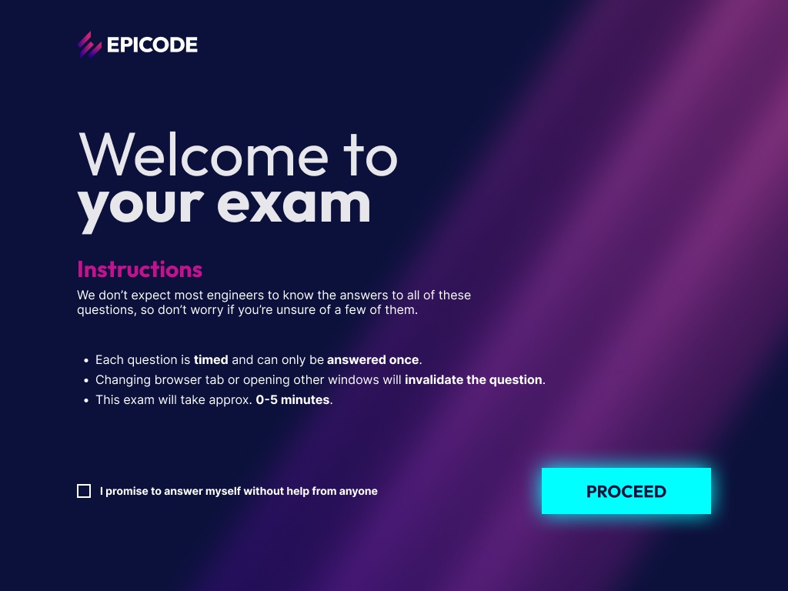
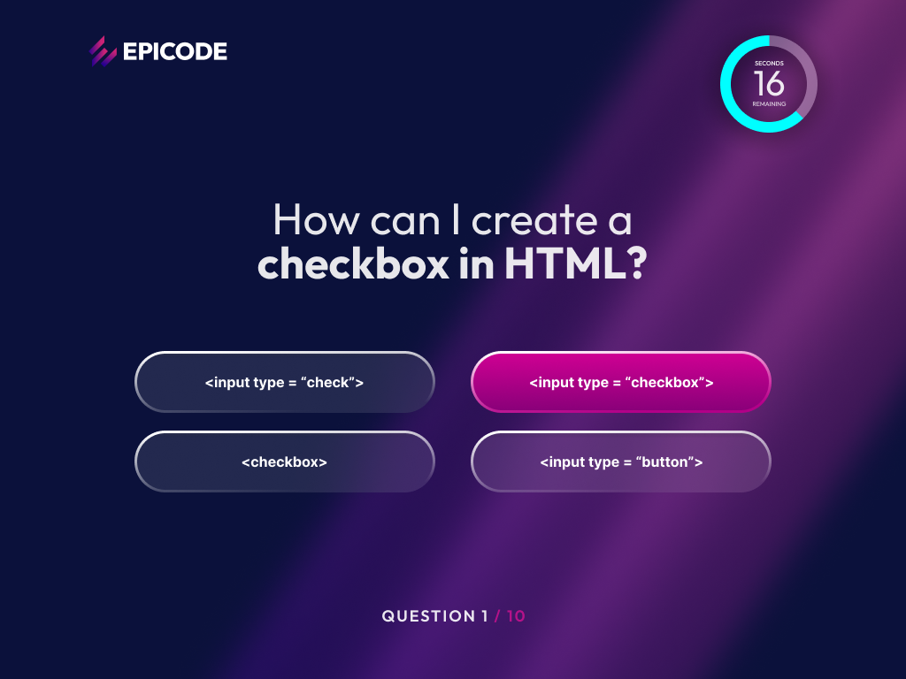

# EPICODE Benchmark Quiz | Build Week (TEAM4)

Web app single-page che riproduce l’esperienza del “Benchmark Exam” di EPICODE: schermata di benvenuto, quiz a tempo con domande a scelta multipla e schermata risultati finali.

## Live Demo
- GitHub Pages: **INSERISCI QUI IL LINK**
  - Esempio [Inferenza]: https://cloroalclero.github.io/TEAM4-Quiz-Test/

## Screenshots
Welcome  


Quiz  


## Funzionalità
- Flusso single-page: **Welcome → Quiz → Results**
- Domande a scelta multipla (una sola risposta)
- Risposte renderizzate dinamicamente
- Timer per domanda con ring circolare
- Calcolo punteggio e schermata finale risultati
- UI responsive (desktop e mobile)

## Tech Stack
- HTML5
- CSS3
- JavaScript (Vanilla)
- Libreria timer ring: progressbar.js (se presente nel progetto)

## Struttura progetto
```txt
TEAM4-Quiz-Test/
├── assets/                 # Immagini (background, logo)
├── css/
│   └── welcome.css         # Stili (welcome + quiz UI)
├── mockup/                 # Reference screens del benchmark
├── index.html              # Entry single-page
└── script.js               # Logica quiz (render, timer, score, results)
